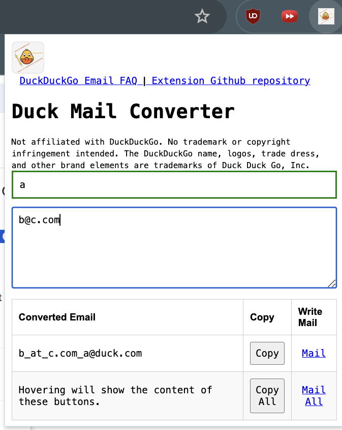
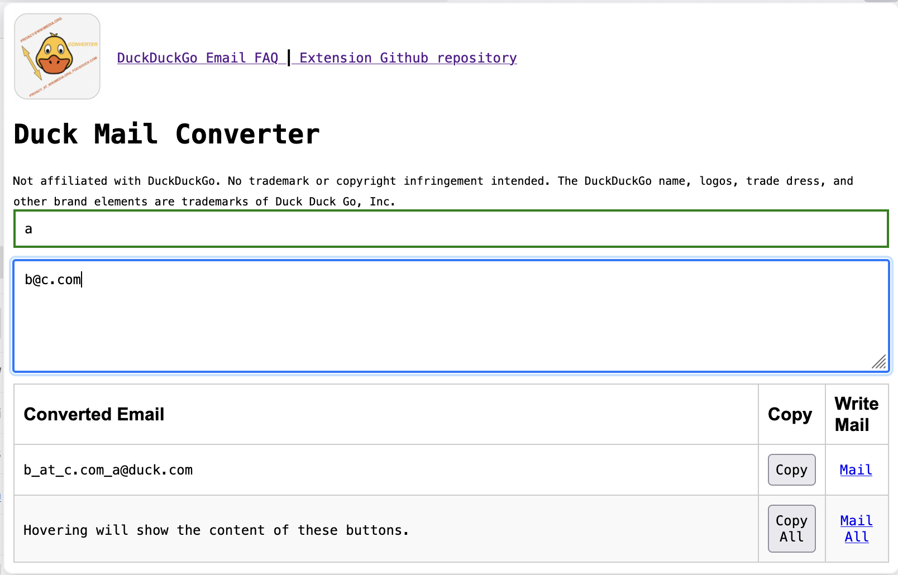
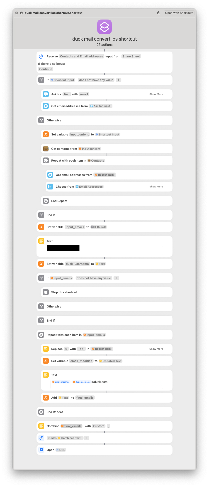

- Convert your target email and your DuckDuckGo Email Protection username to an email ready to be written to.
- Supports [at] and [dot] formatted emails also.
- Supports multiple email conversions also.
- Supports syncing the username and last input emails across profiles.
- Supported on iOS, macOS, Firefox, Thunderbird and Google Chrome 

Illustrative Example:

```
username = a
your email = b@c.com
output = mailto:b_at_c.com_a@duck.com
```

Install:  https://github.com/z-aki/duck_email_converter/releases/latest

For browsers and thunderbird: click on extension store links.

---

For iOS macOS shortcut installation, download the zip from the above link > open the .shortcut file > click on "Add shortcut" > Enter your duck username in the prompt > click "Add".

Usage:

- From the mail app, click on any email sender or recipient. Click on share contact > select the wanted emails and the shortcut will compose a new email to them.

- Alternatively, in the contacts/ phone app, share any contact and the shortcut will compose a new email to its selected emails.

- Alternatively, in the shortcuts app, open this shortcut > add it to homescreen and click on its icon. Then enter the emails in different lines and the shortcut will compose a new email to those recipients. Then they can be added to contact for later re-use.

---

Screenshots

> 
> 
> 

Installation: <https://github.com/z-aki/duck_email_converter/releases/latest>

Contributions:

<https://extensionworkshop.com/documentation/develop/temporary-installation-in-firefox/>

<https://developer.chrome.com/docs/extensions/get-started/tutorial/debug>

<https://developer.thunderbird.net/add-ons/about-add-ons>

----

License = See LICENSE.txt

------

<sub>

Not affiliated with duck.com, DuckDuckGo, Google Chrome, Firefox or GitHub.

The DuckDuckGo name, logos, trade dress, and other brand elements are trademarks of Duck Duck Go, Inc.

Firefox is a trademark of the Mozilla Foundation in the U.S. and other countries.

Google Chrome is a trademark of Google LLC. Use of this trademark is subject to Google Permissions.

GitHub is a registered trademark of GitHub, Inc. in the United States and other countries.

</sub>
